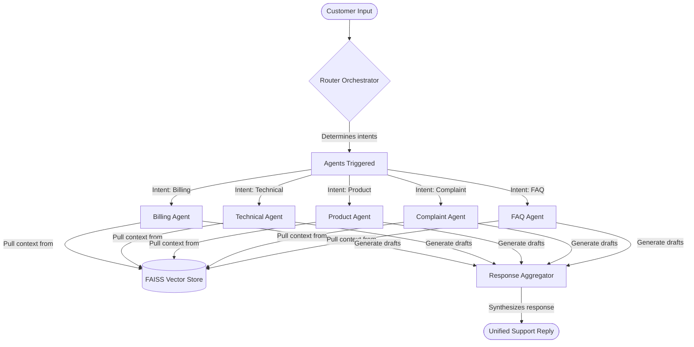

# Multi-Agent AI Customer Support Assistant using RAG and LLMs

A premium, enterprise-grade AI Customer Support portal powered by a **Multi-Agent Orchestration Engine** and **Retrieval-Augmented Generation (RAG)**. 

This project simulates a smart customer support desk for *TechMart Electronics*. The system analyzes incoming user queries, routes them to specialized AI support agents, fetches relevant company documentation from a local vector database, synthesizes a cohesive reply, and handles automatic API failovers between Google Gemini and Groq (Llama 3.3).

---

##  Key Features

*   **Multi-Agent Routing**: A central coordinator analyzes user queries and context history to trigger one or more specialized support agents (`Billing`, `Technical`, `Product & Sales`, `Complaint Resolution`, and `General FAQ`).
*   **Automatic Response Aggregation**: When multiple agents are triggered, a coordinator agent seamlessly merges drafts into a single, cohesive, polite customer response.
*   **Retrieval-Augmented Generation (RAG)**: Uses a local FAISS index and `SentenceTransformers` (`all-MiniLM-L6-v2`) to retrieve matching paragraphs from company manuals, refund guidelines, and warranties.
*   **Failover LLM Architecture**: Centralized LLM client tries **Google Gemini** (`gemini-2.0-flash`) first and automatically fails over to **Groq** (`llama-3.3-70b-versatile`) if Gemini hits rate limits or quota boundaries. If both fail, it falls back to local raw RAG summaries.
*   **Modern Teal & Slate UI**: Responsive Next.js 16 front-end styled with a glassmorphism Slate theme and vibrant Teal accents.
*   **User Session Control**: Full CRUD support for creating and deleting chat sessions, complete with automatic AI-driven chat renaming (like ChatGPT).
*   **Custom Markdown Parsing**: Renders headers, lists, italics, and bold text natively in chat bubbles without third-party dependencies.

---

##  Technology Stack

### Backend
*   **FastAPI**: High-performance Python web framework.
*   **MongoDB**: Stores user credentials, session metadata, and conversation history.
*   **FAISS**: Facebook AI Similarity Search for dense vector retrieval.
*   **Sentence-Transformers**: Embeds documents and queries locally.
*   **Bcrypt & PyJWT**: Secure password hashing and token-based user authentication.

### Frontend
*   **React 19 & Next.js 16**: Modern App Router setup.
*   **Tailwind CSS**: Sleek charcoal and teal styling.

---

##  Project Structure

```text
├── backend/
│   ├── app/
│   │   ├── agents/            # Multi-agent engines (billing, technical, router, etc.)
│   │   │   ├── billing.py
│   │   │   ├── technical.py
│   │   │   ├── product.py
│   │   │   ├── complaint.py
│   │   │   ├── faq.py
│   │   │   ├── router.py      # Classification & aggregation orchestrator
│   │   │   └── llm_client.py  # Gemini & Groq failover router
│   │   ├── database.py        # MongoDB connection and serialization helpers
│   │   ├── config.py          # Environment settings
│   │   ├── main.py            # API Routes (auth, sessions, chat messages)
│   │   └── rag/
│   │       ├── ingest.py      # Knowledge base PDF/Markdown parser and indexer
│   │       └── retriever.py   # FAISS retriever query script
│   ├── vectorstore/           # Pre-compiled FAISS indexes and metadata
│   ├── requirements.txt
│   └── .env
├── frontend/
│   ├── src/
│   │   ├── app/               # Page routing & styling
│   │   │   ├── page.tsx       # Main support chat portal interface
│   │   │   └── layout.tsx
│   │   └── context/
│   │       └── AuthContext.tsx # Authentication state machine
│   ├── package.json
│   └── next.config.ts
└── knowledge_base/            # TechMart policies (Warranties, Manuals, FAQs)
```

---

##  Configuration Setup

### 1. Backend Configuration
Navigate to the `backend/` folder and create a `.env` file:

```env
# Google Gemini API Key
GEMINI_API_KEY=your_gemini_api_key_here

# Groq API Key
GROQ_API_KEY=your_groq_api_key_here

# MongoDB Setup
MONGODB_URL=mongodb://localhost:27017
MONGODB_DB_NAME=customer_support_db

# Security
JWT_SECRET=supersecretjwtkeythatshouldbechanged123!
JWT_ALGORITHM=HS256
JWT_ACCESS_TOKEN_EXPIRE_MINUTES=120
```

---

##  Running the Application

### Prerequisites
*   Ensure **MongoDB** is running locally (`mongodb://localhost:27017`).

### 1. Ingest Knowledge Base
Before starting the backend, index the company policy files located in the `knowledge_base/` folder:
```bash
cd backend
python app/rag/ingest.py
```
This parses the markdown/PDF manuals, creates vector embeddings, and saves the index inside the `vectorstore/` folder.

### 2. Start the Backend API
Install dependencies and launch the Uvicorn server:
```bash
# In backend directory
pip install -r requirements.txt
uvicorn app.main:app --reload --host 127.0.0.1 --port 8000
```
The API documentation will be available at `http://127.0.0.1:8000/docs`.

### 3. Start the Next.js Frontend
Navigate to the `frontend/` folder, install packages, and boot the server:
```bash
cd frontend
npm install
npm run dev
```
Open `http://localhost:3000` in your web browser.

---

##  Agent Flow Architecture



---

##  Failover & Fallback Logic

Each support agent uses a resilient API call handler:
1.  **Google Gemini (`gemini-2.0-flash`)** generates the response using the RAG context.
2.  If Gemini fails (Quota Exceeded `429`, server overload, or billing lock), the engine prints `Attempting Groq failover...` in the backend console.
3.  **Groq (`llama-3.3-70b-versatile`)** takes over transparently and resolves the request within milliseconds.
4.  If both API calls fail (e.g., offline mode), the agent returns a **formatted, structured summary of the raw retrieved documents** to ensure the customer receives the requested info immediately.

---

## 🌐 Deployment Guidelines

Deploying this multi-agent assistant involves configuring and launching three core components: the database, the backend API service, and the frontend portal.

### 1. Database Setup (MongoDB Atlas)
*   **Create Cluster**: Launch a free shared cluster on MongoDB Atlas.
*   **Configure Access**: Create a database user credentials profile with read/write access.
*   **Network Security**: Whitelist your backend host server's IP address or allow global access (`0.0.0.0/0`).
*   **Retrieve Connection String**: Copy the MongoDB connection URI for your backend configuration.

### 2. Backend Service Deployment (Render, Railway, or AWS)
*   **Host Service**: Connect your GitHub repository to a cloud provider and set the project root path to the `backend/` directory.
*   **Define Variables**: Input the environment keys (`GEMINI_API_KEY`, `GROQ_API_KEY`, the Atlas MongoDB connection URI, and a secure `JWT_SECRET` string) on your hosting dashboard.
*   **Manage Vector Store**: Ensure the pre-compiled FAISS `vectorstore/` directory is committed to Git so the server loads the indices immediately, or trigger a post-deployment script to compile the documents.
*   **Configure Port Binding**: Set the startup runtime command to bind Uvicorn to your provider's dynamic PORT environment variable.

### 3. Frontend Deployment (Vercel or Netlify)
*   **Host Portal**: Connect your repository to Vercel and configure the root directory to point to the `frontend/` folder.
*   **Set Environment variables**: Add a public API endpoint variable pointing directly to your deployed Backend API URL.
*   **Build & Publish**: Run the production build compiler on Vercel to optimize and bundle the static pages.
